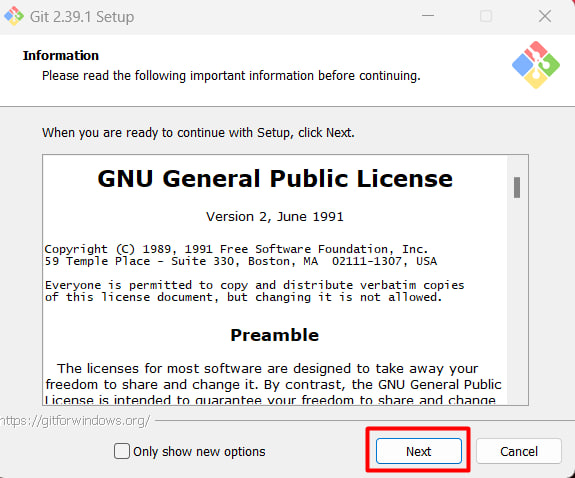
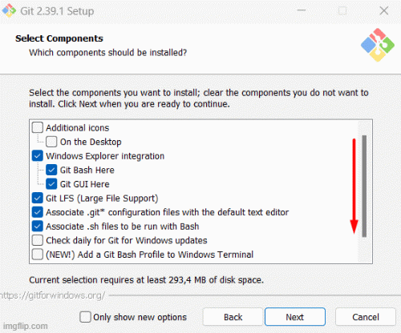
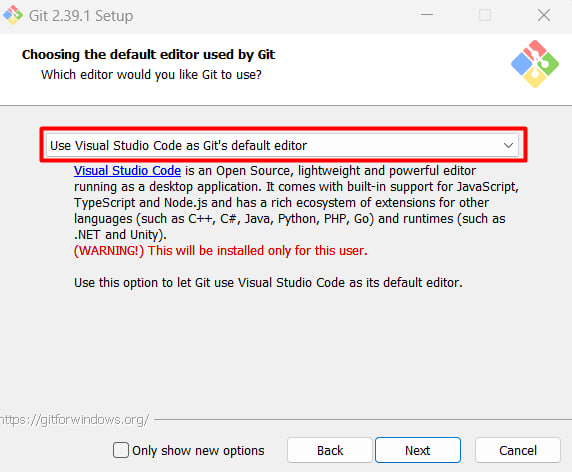
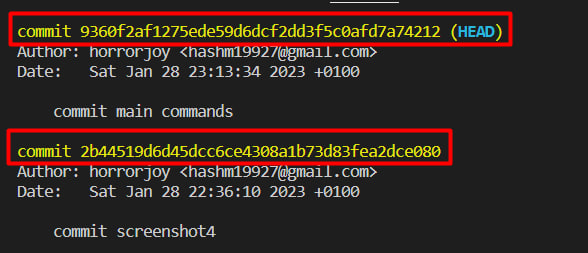

# Git instruction

## Downloading program and instalation

- Step 1 (Downloading)

We need to download Git. Link for downloading the program:
https://git-scm.com/downloads

You need to select the configuration of your computer and install the desired version

- Step 2 (Installation)

**Run the uploaded file, read the agreement and click "next"**

**Next, select the checkboxes we need to install. (For further work, it is better to choose those that you see on the GIF)**

**Next, select the editor in which you will work. If you have Visual studio code installed, then select it, because we will perform further work in it.
If not, then choose Vim, later you can change**

**Next, leave all the checkboxes as they are. In the last window, you should only pay attention to the offers. But, it is up to you whether you want to receive notifications or not. They can be removed.**

## Congratulations, you have installed Git.

## *For further work, let's go through a little the basic commands that we need to work in Git*

#  Basic commands to get started

*git --version:* Indicates the version of git that is installed on your computer. And the path to the file

*git init:* Initializing or creating a repository

*git add .* Adding a file/folder for further work with it in editor. **Adding all files at once, if we put a "dot"**

*git add 'files_name':* Adding a file/folder for further work with it in editor. **Adding the specific file you want**

*git commit -m 'comment':* Creating a commit. Saving the work you've done.

#  Additional Commands for Checking Data and Reverting to Commits

*git log:* Get changes, saves, and commit codes so that you can return to that branch of work if necessary

*git checkout <first 4 digits of the code branch>:* command to go back to the save/commit you want to go back to

The first 4 digits will be enough to return to commit you want.

## *Russian instructions about fonts*

## Выделение текста

чтобы выделить текст курсивом, необходимо обромить его звездочками (*), или знаком нижнего подчеркивания (_) Например *вот так* или _вот так_

чтобы выделить текст полужирным, необходимо обромить его двумя звездочками (**), или знаком нижнего подчеркивания (_) Например **вот так** или _вот так_

Альтернативные способы выделения текста жирным или курсивом нужны для того, чтобы мы могли совмещать оба этих способа, например:
_Текст моежт быть выделен курсивом и полужирным_, при этом **полужирным**