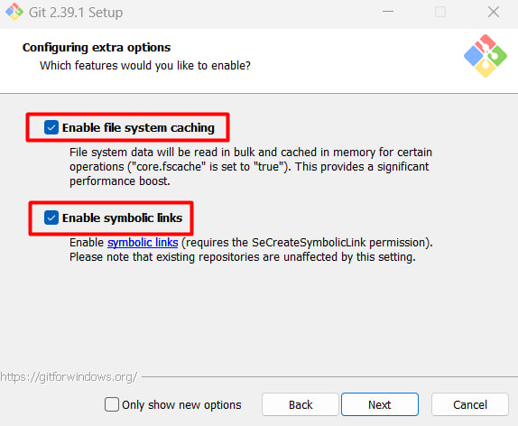

# Git instruction

## Downloading program and instalation

- Step 1 (Downloading)

We need to download Git. Link for downloading the program:
https://git-scm.com/downloads

You need to select the configuration of your computer and install the desired version

- Step 2 (Installation)

**Run the uploaded file, read the agreement and click "next"**

**Next, select the checkboxes we need to install. (For further work, it is better to choose those that you see on the GIF)**

**Next, select the editor in which you will work. If you have Visual studio code installed, then select it, because we will perform further work in it.
If not, then choose Vim, later you can change**

**Next, leave all the checkboxes as they are. In the last window, you should only pay attention to the offers. But, it is up to you whether you want to receive notifications or not. They can be removed.**

## Congratulations, you have installed Git.

